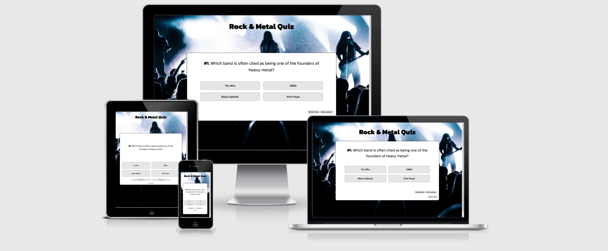
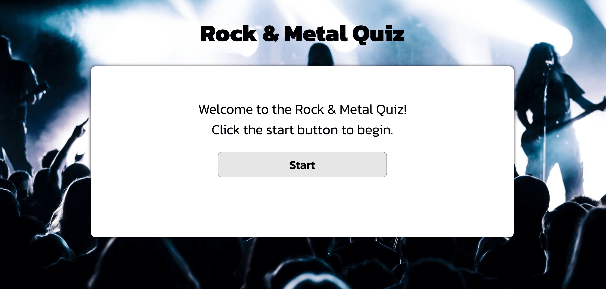
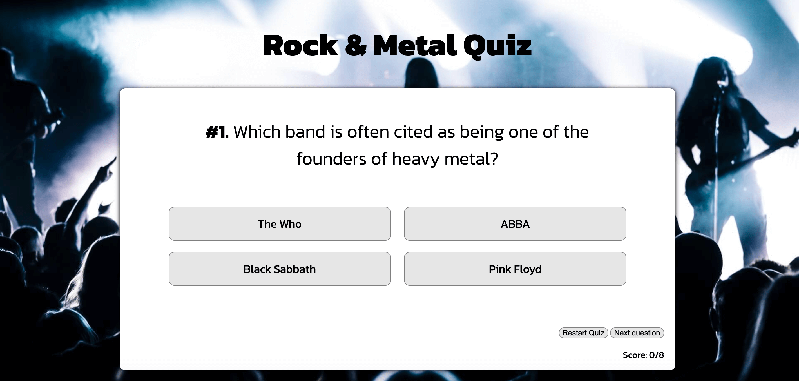
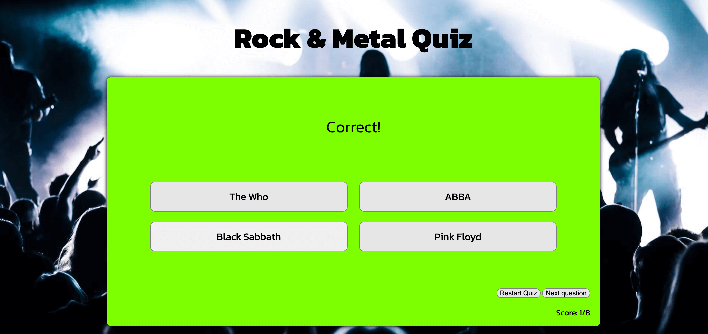
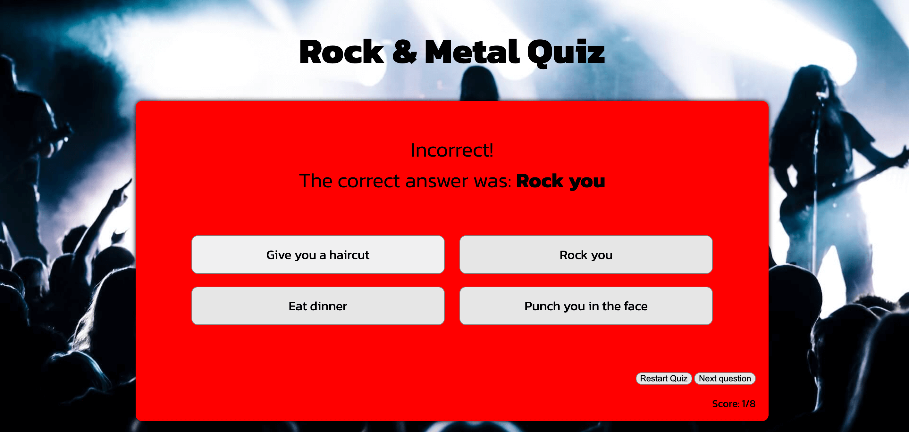
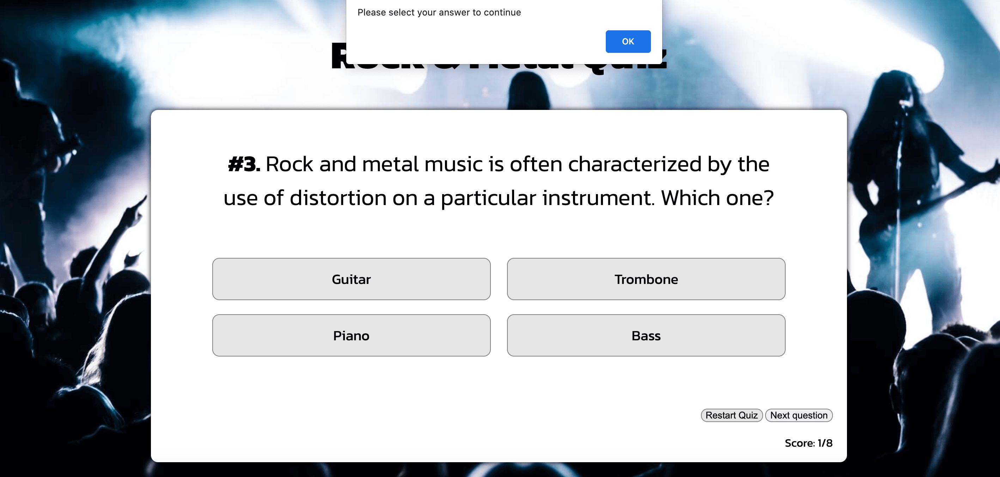

# Rock & Metal Quiz

Rock & Metal Quiz is as the name suggests, a music themed quiz meant to test your knowledge specifically about rock and metal.

## **Features**

- **Front Page** 
  - The first thing the user sees is a white box with a simple welcome message and a start button that takes you to the actual quiz.

  -Behind the box is an image of a concert from the audience's perspective, covering the entire page.

- **Quiz Page**
 - The quiz page is comprised of a total of 8 questions, with 4 options to chose from for every question. The users total score is displayed at the bottom right of the box.

- A correct answer will trigger a message along with a green background.

- An incorrect answer will trigger a message along with a red background. It will also display the correct answer.

- **Navigation**
  - The navigation consists of 2 simple buttons at the bottom right of the box.

  - The button named 'Restart' will take the user back to the front page and let them start the quiz from the beginning.

  - The button named 'Next Question' will take the user to the next question after choosing an answer. If they did not choose one, an alert will pop up, telling them to do so.
  

### Testing

- I have tested that this website is responsive, looks good and works as intended on the different standard screen sizes, using the devtools device toolbar in Google Chrome.

- I have tested that this website works in different browsers: Chrome, Safari, Firefox.

- I have confirmed that the quiz is fully functional. The different buttons do what they're supposed to do and trigger their respective functions.

### Validator Testing
- HTML
    - No errors were found when passing through the official [W3C Validator]

- CSS
    - No errors were found when passing through the official [(Jigsaw) Validator]

### Unfixed Bugs
No unfixed bugs

## Deployment

- The site was deployed to GitHub pages. The steps to deploy are as follows:
    - In the GitHub repository, navigate to the Settings tab
    - From the source section drop-down menu, select the Master Branch
    - Once the master branch has been selected, the page will be automatically refreshed with a detailed ribbon display to indicate the successful deployment.

The live link can be found here:

## Credits

### Content
- 

### Media
- 